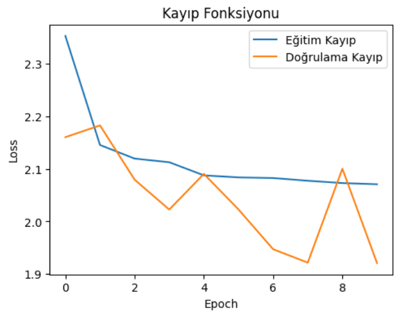
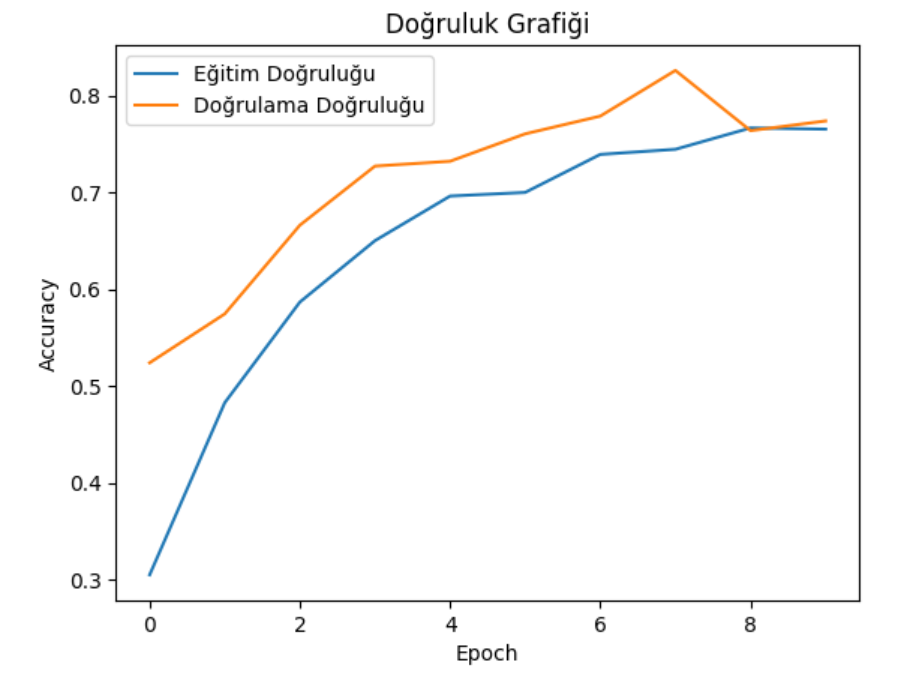
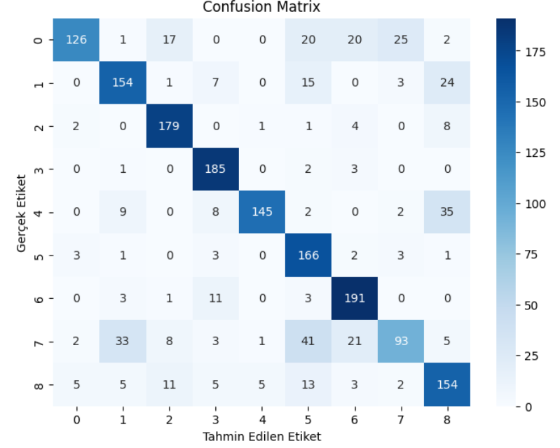
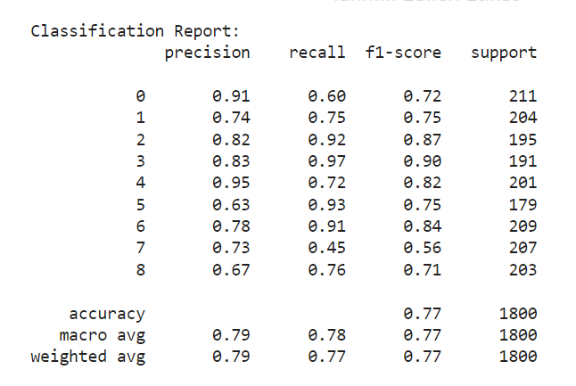

# Fish Species Classification

**Veri Seti**: [Fish Dataset](https://www.kaggle.com/datasets/crowww/a-large-scale-fish-dataset/data)

**Kaggle**: [Fish Species Classification Notebook](https://www.kaggle.com/code/abdulkadirsoyuk/fish-species-classification)

## Proje Tanıtımı

Bu proje, balık türlerini sınıflandırmak amacıyla bir yapay zeka ve makine öğrenimi süreci içerir. Kullanılan veri seti, balıkların çeşitli görüntüleri ve türleri ile ilişkilendirilmiştir. Proje, veri hazırlığı, model geliştirme, model eğitimi ve sonuçların değerlendirilmesi aşamalarını kapsamaktadır.

## Yöntemler

1. **Veri Hazırlığı**: Balık görüntüleri ve etiketleri, bir Pandas DataFrame'e dönüştürülmüş ve eğitim/test setlerine ayrılmıştır.
2. **Görüntü İşleme**: Görüntüler yeniden boyutlandırılarak normalize edilmiştir.
3. **Model Geliştirme**: Düzleştirilmiş görüntü girişlerini kullanarak bir yapay sinir ağı modeli oluşturulmuştur.
4. **Model Eğitimi**: Model, eğitim veri setinde eğitilmiş ve doğrulama seti ile performansı izlenmiştir.
5. **Model Değerlendirmesi**: Karışıklık matrisi ve sınıflandırma raporu ile modelin performansı değerlendirilmiştir.
6. **Hiperparametre Optimizasyonu**: Modelin hiperparametreleri Keras Tuner kullanılarak optimize edilmiştir.

## Sonuçlar

### Eğitim ve Doğrulama Kayıp Fonksiyonu

### Eğitim ve Doğrulama Doğruluğu

### Confusion Matrix

### Classification Report

## Kullanılan Kütüphaneler

- `pandas`
- `numpy`
- `matplotlib`
- `seaborn`
- `tensorflow`
- `keras_tuner` 
